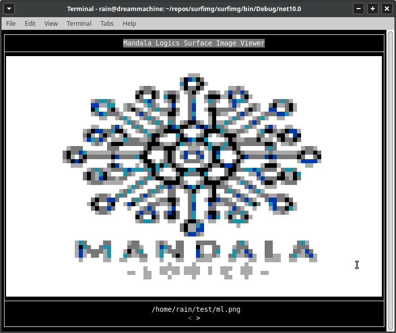
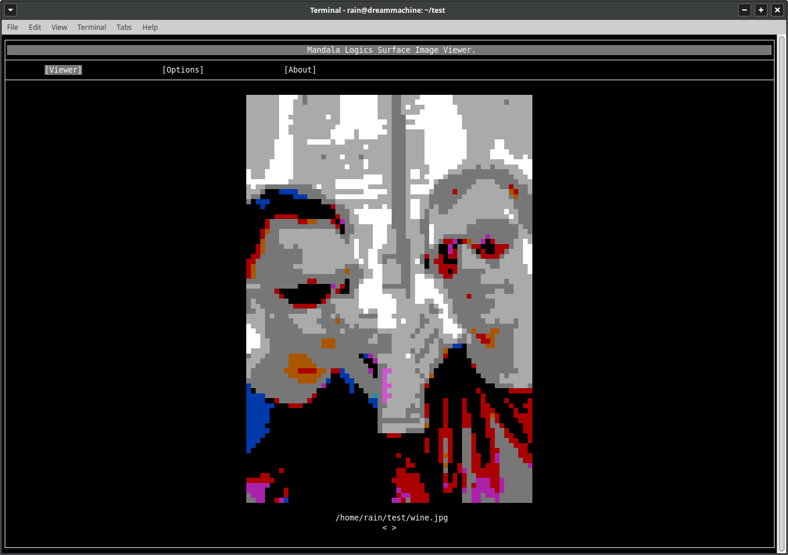

# surfImg




surfImg is a lightweight console-based image viewer built on top of the MandalaLogics SurfaceTerminal rendering system. It loads images using ImageSharp and renders them directly inside a terminal window by mapping pixel data to coloured console characters. Despite running entirely in a text console, the viewer supports colour rendering and simple navigation between images in a directory using keyboard input.

The project also serves as a demonstration of the SurfaceTerminal framework — a small terminal UI system that provides layout management, panel rendering, and input handling using a composable surface-based rendering model. While the viewer itself is intentionally simple, it showcases how complex terminal interfaces can be built using structured layouts and efficient console rendering techniques.

## Usage

``` shell
    surfimg [-h] path
```

If the specified path is a file, then that file is opened, and if the path is a dir then the images in the dir can be browsed; in both cases the left and right arrows allow for sifting through pictures.
